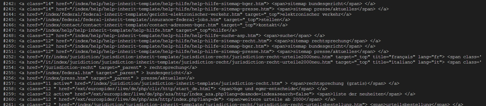

# 1. PyScrape

- PyScrape parses webpages by HTML-Tags. This module will be used in my web-scraper application
- General idea: Highly customizable (TAG and its attributes with filter-options like parent-/child-tag) web-scraper

## 1.1. Roadmap/ToDo
- [x] Basic functionality
- [x] exceptions
  - [x] request-exceptions (ConnectionError/RequestException/URL-&Tag-Check)
  - [x] Check for HTTP-StatusCode
  - [ ] if OUTPUT is set to txt, verify OUTPUT_FILENAME and handle exceptions.
- [x] pre-parse html-content (tabs/spaces etc..)
- [x] add parser
- [x] add match-counters
- [x] configure output
- [x] configuration
- [ ] Add additional Parse-Options 
  - [ ] Get Inner/Outer HTML
  - [ ] Filter by ID/Class/Style(?)/href etc..
- [ ] Add "Parent-of" and "Child-of" functionality (e.g: only get <*a*> from <*div class="blub">*)

## 1.2. Ideas/WishList
- When tag and optionally parent/child-tag is known, return all Elements of that object:
  - Inner HTML/Outer HTML, all attributes

## 1.3. Screenshot


## 1.4. Usage

1. configure .env
  
    (or leave it empty for testing purposes with default values) 
    ```
    URL: Web-Page to parse                      e.g.: https://20min.ch
    ENCAPSULATED_TAG: HTML-Tag to look for      e.g.: a
   ``` 
2. run


---
 [](https://www.gnu.org/licenses/gpl-3.0) 
 
 :copyright: 2023, Garbis Ciftci 
    
*Copying and distribution of this file, with or without modification, are permitted in any medium 
without royalty, provided the copyright notice and this notice are preserved. This file is offered 
as-is, without any warranty.*
    
